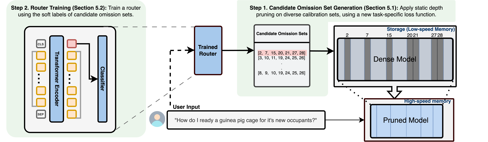

# Prompt-based Depth Pruning of Large Language Models (PuDDing)

### [Paper](https://arxiv.org/abs/2502.04348) | [Project page]()

<br>

Juyun Wee\*, Minjae Park\*, and Jaeho Lee

Pohang University of Science and Technology (POSTECH), South Korea.

<br>

Our method, PuDDing (Prompt-routed Dynamic Depth Pruning), reduces memory usage and accelerates inference of large language models by selectively removing Transformer blocks based on the input prompt using a lightweight pretrained router.

## Abstract

Depth pruning aims to reduce the inference cost of a large language model without any hardware-specific complications, by simply removing several less important transformer blocks. However, our empirical findings suggest that the importance of a transformer block may be highly task-dependent -- a block that is crucial for a task can be removed without degrading the accuracy on another task. Based on this observation, we develop a dynamic depth pruning algorithm, coined PuDDing (Prompt-routed Dynamic Depth Pruning), which determines which blocks to omit from the model based on the input prompt. PuDDing operates by training a lightweight router to predict the best omission set among a set of options, where this option set has also been constructed in a data-driven manner. Empirical results on commonsense reasoning benchmarks demonstrate that PuDDing effectively accelerates the inference language models, and achieves better on-task performance than static depth pruning baselines.

<center>

</center>

## Inference

Will be updated soon...

## Citation
```
@inproceedings{wee2025prompt,
  title={Prompt-based Depth Pruning of Large Language Models},
  author={Wee, Juyun and Park, Minjae and Lee, Jaeho},
  booktitle={International Conference on Machine Learning},
  year={2025}
}
```