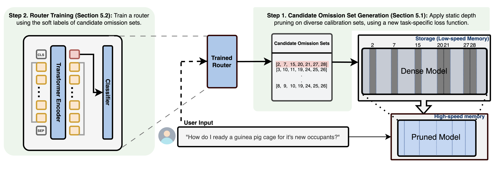

# Prompt-based Depth Pruning of Large Language Models (PuDDing)

### [Paper](https://arxiv.org/abs/2502.04348) | [Project page]()

<br>

Juyun Wee\*, Minjae Park\*, and Jaeho Lee

Pohang University of Science and Technology (POSTECH), South Korea.

<br>

Our method, PuDDing (Prompt-routed Dynamic Depth Pruning), reduces memory usage and accelerates inference of large language models by selectively removing Transformer blocks based on the input prompt using a lightweight pretrained router.

## Abstract

Depth pruning aims to reduce the inference cost of a large language model without any hardware-specific complications, by simply removing several less important transformer blocks. However, our empirical findings suggest that the importance of a transformer block may be highly task-dependent -- a block that is crucial for a task can be removed without degrading the accuracy on another task. Based on this observation, we develop a dynamic depth pruning algorithm, coined PuDDing (Prompt-routed Dynamic Depth Pruning), which determines which blocks to omit from the model based on the input prompt. PuDDing operates by training a lightweight router to predict the best omission set among a set of options, where this option set has also been constructed in a data-driven manner. Empirical results on commonsense reasoning benchmarks demonstrate that PuDDing effectively accelerates the inference language models, and achieves better on-task performance than static depth pruning baselines.

<center>

</center>

## Step-by-step Instructions

This project is based on the **Prompt-based Dynamic Depth pruning (PuDDing)** model and consists of the following four stages:

1. **Selecting omission layers**
2. **Generating the dataset**
3. **Training the router**
4. **Evaluating the pruned model using the trained router**

The current codebase is organized for easy execution, and we plan to further refactor it into a cleaner and more efficient structure in the future.

---

# 0.Environment Setting

Create a conda environment using the `environment.yml` file:

```bash
conda env create -f environment.yml
conda activate pudding
```

---

# 1. Selecting omission layers
```bash
bash _1_layerset_llama.sh
```
- The omission sets will be saved in result/9_llama/data/4_analysis.

- Check the generated 10 omission sets and save them as CSV files for dataset generation.

    - Example file: codes/llama_layer_list_6_advanced_tasks.csv

    - Convert and save the omission set results in the same format as the example CSV file.


# 2. Generating the dataset
```bash
bash _2_dataset_llama.sh
```
- If you have selected a new omission set, specify its CSV file path in the open_path variable within 2_dataset_llama.sh.

- Also, update the path in v23_script where it reads:
```
with open('codes/llama_layer_list_6_advanced_tasks.csv', mode="r")
```
to point to your new omission set CSV file.

- The task-specific datasets will be generated in result/9_llama/data/5_log5.

- Combine the datasets of the 5 tasks into a single CSV file named all_log.csv.

    - Example file: result/9_llama/data/6_adavanced_tasks/all_log.csv


# 3. Training the router
```bash
bash _3_train_router_MSE.sh
```
- If you have generated a new dataset, update the CSV file path in _3_train_router_MSE.sh accordingly.

- Currently, it is set to train using the example dataset.

# 4. Evaluating the router
```bash
bash _4_eval_router.sh
```

## Citation
```
@inproceedings{wee2025prompt,
  title={Prompt-based Depth Pruning of Large Language Models},
  author={Wee, Juyun and Park, Minjae and Lee, Jaeho},
  booktitle={International Conference on Machine Learning},
  year={2025}
}


